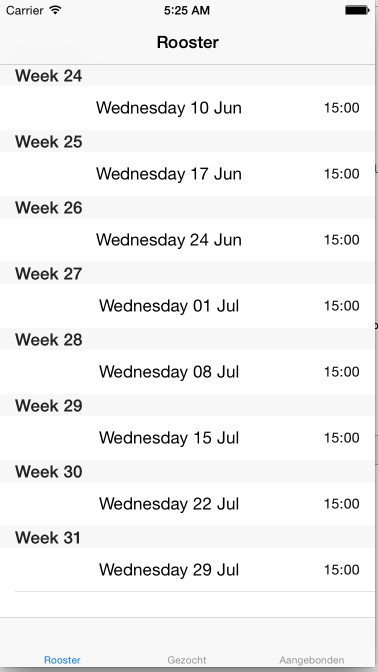
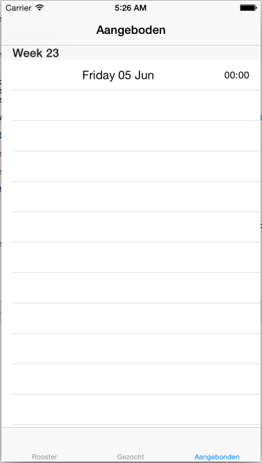
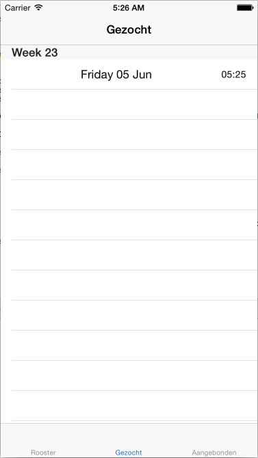
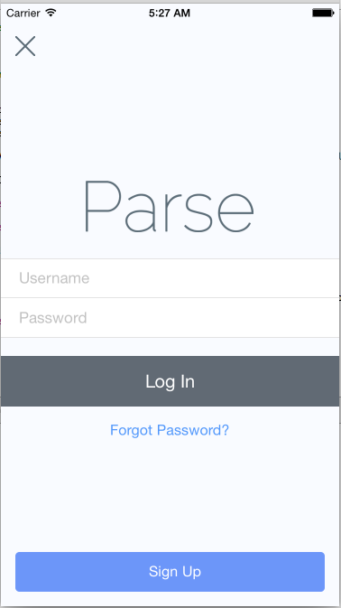

# Design Document

##### Introduction

My will consist of five view controller. The LoginViewController, RoosterViewController, GezochtViewController, AangebodenViewController
and the SubmitRoosterViewController. The three main views (Rooster, Gezocht and Aangeboden) are embedded in a TableView. The indiviual views are also embedded in a NavigationView. That is a workaround to have a titlebar in each view.

##### Minimum Viable Product
* Overview of fixed schedule
* Overvies of filled-in shifts
* Users can interact with database (shifts get sent to appropriate table view)

##### Additional Features
* Gamefication: Users can earn points by working shifts that others supplied. Scores can be seen on a leaderboard.
* Admin: Account for a store/restaurant manager. This account can approve shifts changes directly in the database.
* Online Acces for non-iOS users
* Users can specify the hours worked on each shift

##### ViewControllers

###### RoosterView

This is where all de user specific information will be displayed. Behind the table view there is an other view that shows when the table has no content. In this view the user can press a UIButton to go to the SubmitRoosterViewController.
* Fixed Shifts (including status of 'sold' shifts)  
  * "Sold": Red
  * "Awaiting Approval": Orange
* requestFixedRooster()
* getSections(shifts: [Shifts])
* getSectionItems(section: Int) -> [String]

* Extra Shifts

###### AangebodenView

* All shifts that are put on the marketplace by users

###### GezochtView

* All shifts users volunteered to work

###### LoginView

* PFLoginViewController
* Easy fix for login and user management (Parse/ParseUI)
* Also takes care of sign up

##### Classes
* Rooster  
  * Generates a fixed schedule for a given set of shifts (specified by date and time)
   * addRecurringSfhit(day: String, hour: Int, minute: Int)
   * nextOcurreneOfDay(day: Int) -> NSDate
  * Should handle communication with the database
  * Stores all data that is 

* Shift
  * Represents a shift. Consists of a NSDate() and two variables representing the Date and the Time of the shift.
   * init(day: Int, month: Int, year: Int, hour: Int, minute: Int)
   * init(date: NSDate)
   * getWeekDay -> String

##### API's
* Dependency manager: CocoaPods
* SwiftDate (date creation and calculation)
* Parse (Database/login)
* SWTableViewCell (Custom cells, swipe options)
