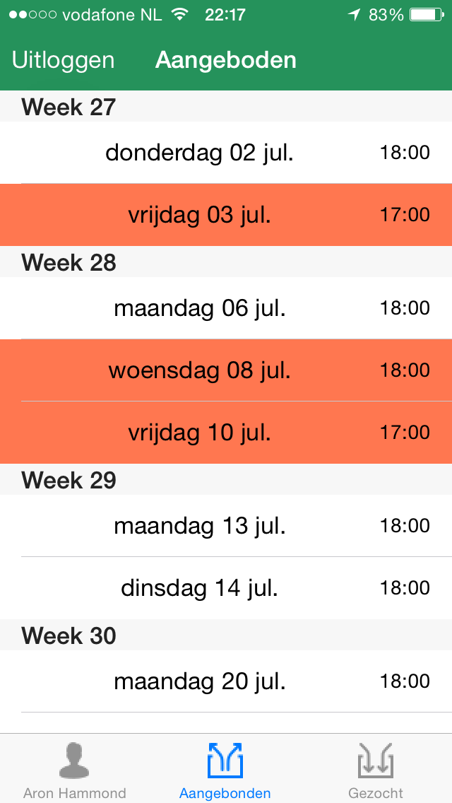

# Shifty
This project is licenced under the MIT licence  
Copyright (c) 2015 Aron Hammond

###### Language disclaimer
This proposal and all other documentation will be written in English. However, the UI of the app will be in Dutch. For this reason, sometimes Dutch words will appear in either the code, the comments and the documentation. I will be consistent and do my best to distinguish them from the rest as good as possible.

## The idea ##
Shifty is a marketplace for shifts whithin small businesses. The app alows employees to view each others scheduele and post request for shifts that they want to be filled in by others or volunteer to work a certain shift. All this information will be available to all relevant employees at the company. This idea came to mind because I work at a restaurant where all servers are part-timers that study/have a life on the side. All this (trading shifts) is currently done via What's-app and there is no overview of all the activity, which is cause for disputes from time to time.

##### Funcionality:
- Supplying your shifts to the marketplace
- Volunteer to work a shift (or accept a supplied shift)
- Overview of personal scheduele
- Overview of submitted requests/supplies shifts

##### External libraries:
- ParseFramework: used to handle database interaction
- SwiftDate: used for date calculations and manipulations

##### Log in/Sign up
This is provided by the Parse framework. New users can sign up via the "SIGN UP" button. The right screen is a sketch of the sign up screen (minimum info required). A returning user can log in. 

##### Main view
This is where all the app functionality takes place. The main view consists of a tab controller with three subviews. *Rooster* where the user's personal schedule can be viewed (left). From here the user can send requests to the marketplace. The market place is split up into two sections: *Gezocht* (middle) and *Aangeboden* (right). In these sections a user can view requests from either poeple who are looking for a replacement and volunteering to fill-in shifts respectively.
In the *Rooster* tab, shifts that sent to the market place will be highlighted in a particular color. Shifts that are owned by the user (fixed, or taken from a colleague) are not.  

| Color | Status |
|-------|--------|
| Red | Supplied |
| Gold | Awaiting approval |

##### More Views
Left: SubmitRoosterView, middle-left: SuggestionView, middle-right: SuggestionOverviewView, right: SelectRequestView
The submit view is used to fill in a fixed shifts  that will be loaded into a user's personal schedule. The Suggestionview is used to select one or more shift to suggest to a request (and in the future to propose for a trade). The SuggestionOverviewView shows suggestion made to the selected request from the GezochtView. A user can posts its own request via the SelectRequestView

##### Interaction
The `UIAlertController` displays actions corresponding with the status of the shift.

