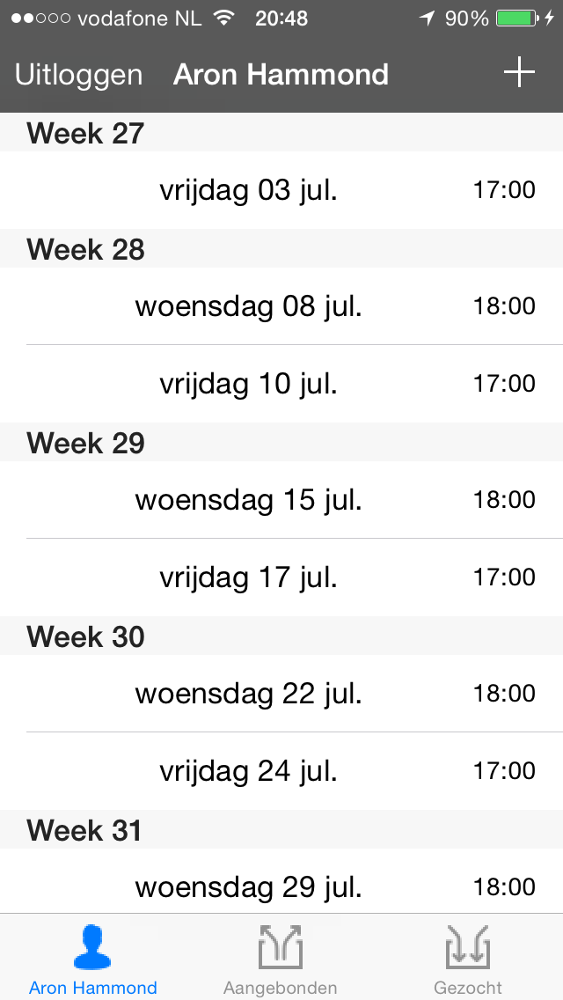
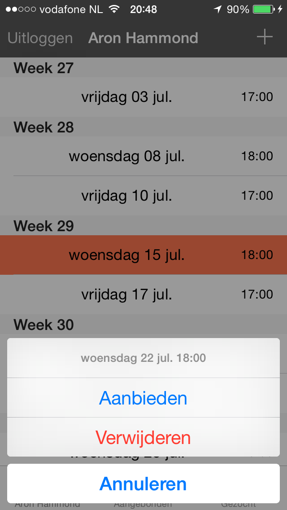
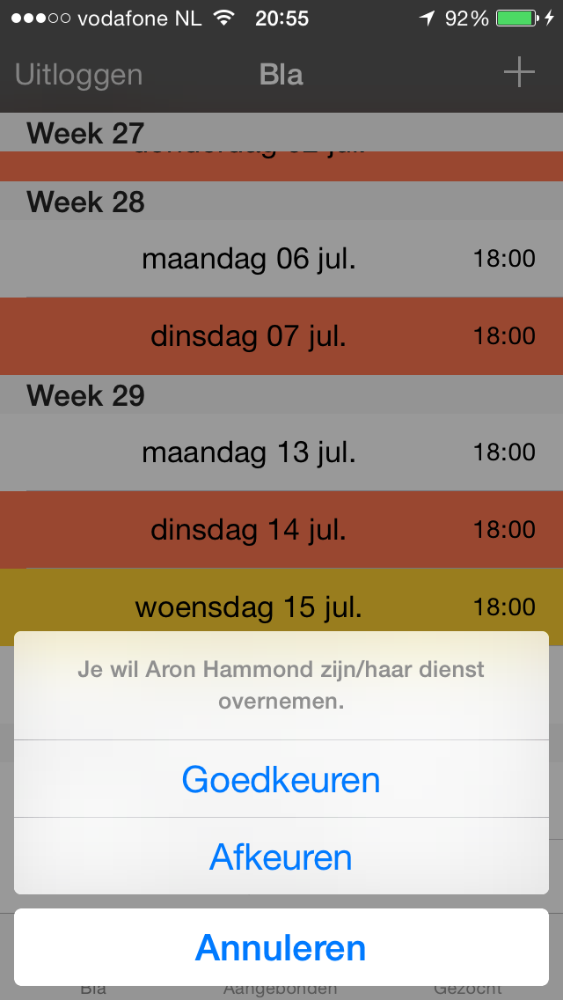
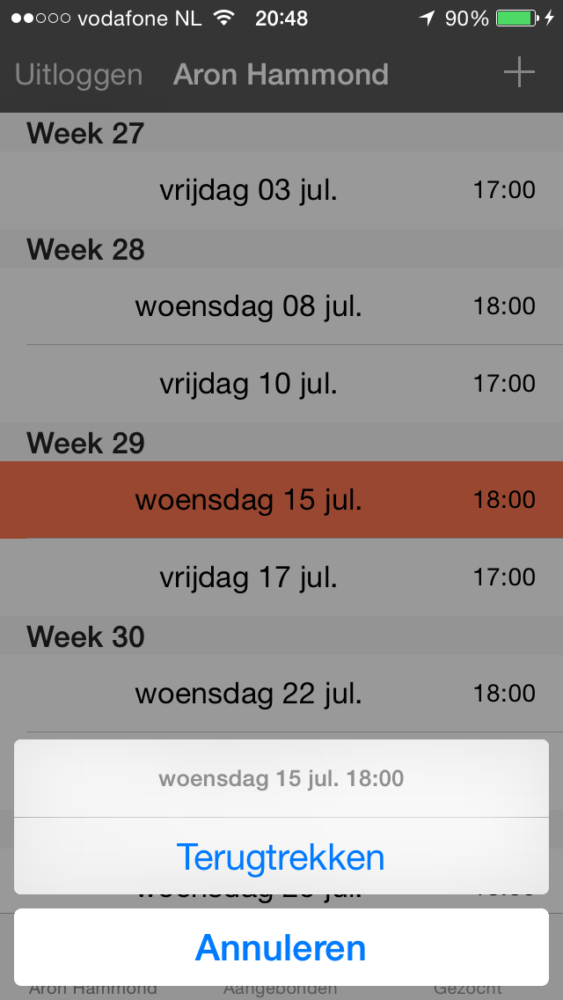
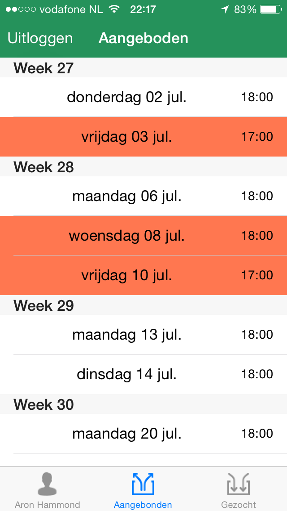
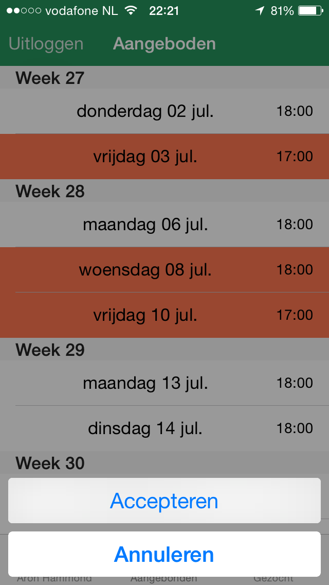

# REPORT

## Structure

##### ViewControllers

   

###### RoosterViewController
This is the main view of the application. It consists of a UITableView that shows all shifts that are owned  
by the user. The class has an upadateSchedule() method that ensures the user's fixed shifts are always preloaded  
eight weeks ahead. Cells are highlighted to indicate their status. Selecting a row in the UITableView summons a UIActionController with actions related to the  
status of the shift. The "+" sign in the upper right corner triggers a segue to the SubmitRoosterViewController.  

###### AangebodenViewController
This is the marketplace. All shift that are supplied by users are displayed. Also for this view goes, that selections prompts
a UIALertController Shifts owned (ergo supplied) by the current userare highlighted in red and can be revoked. Once a shift
has been revoked or accepted, it dissapears from the marketplace. This means that accepting a supplied shift is final.
##### Classes

## Experience

##### Hurdles
##### Gained insights
